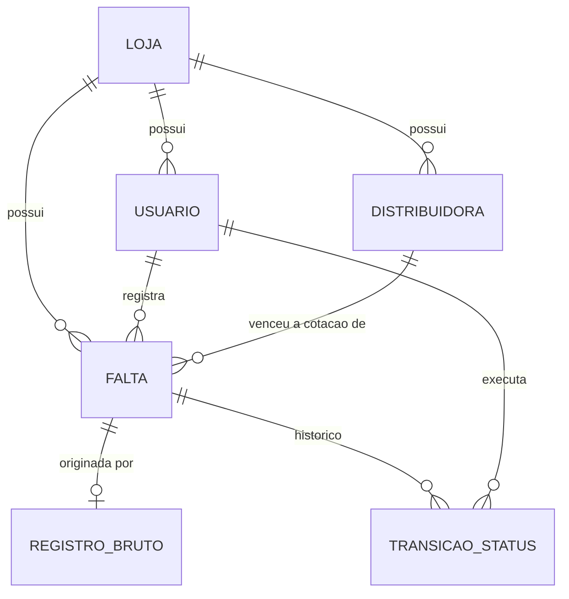
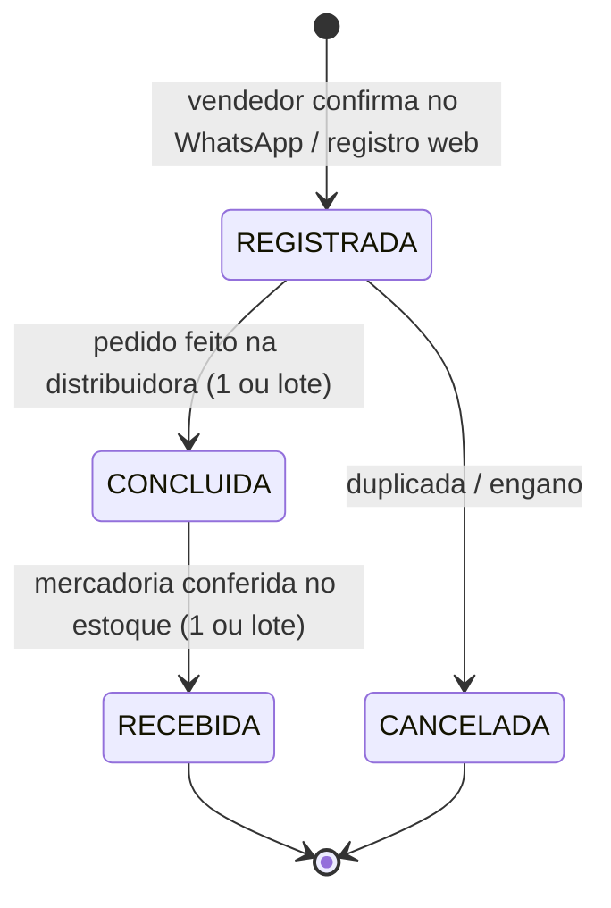

# Modelo de Domínio — Meu Copiloto

> Entidades, invariantes, papéis e o ciclo de vida da falta. Este documento é a fonte de verdade do domínio; o código do `domain/` deve refleti-lo, e mudanças conceituais começam aqui.

## 1. Visão geral

## 2. Entidades

### 2.1 Loja (`Store`)

Raiz do isolamento de dados. **Toda** entidade carrega `store_id` desde o dia 1, mesmo com o MVP operando com uma única loja (ver ADR sobre escopo do MVP).

| Campo | Tipo | Regras |
|---|---|---|
| `id` | uuid | — |
| `codigo` | texto | único global; identificador de login do terminal da loja (ver 2.2) |
| `senha_hash` | texto | nunca em texto puro; sem ela, o login do terminal fica indisponível |
| `nome` | texto | obrigatório |
| `segmento` | enum | `AUTOPECAS` no MVP; extensível (mercado, farmácia...) |
| `whatsapp_numero` | texto | número da Cloud API vinculado à loja |
| `ativa` | booleano | loja desativada bloqueia login e captura |

### 2.2 Usuário (`User`)

Cada papel usa um conjunto de credenciais diferente (ver [ADR-0007](adr/0007-login-loja-e-pin-vendedor.md)): ADMIN/COMPRADOR/GERENTE logam com e-mail+senha, de qualquer lugar; VENDEDOR loga pela sessão do terminal da loja (código+senha) + escolha do próprio nome + PIN.

| Campo | Tipo | Regras |
|---|---|---|
| `id` | uuid | — |
| `store_id` | uuid | obrigatório |
| `nome` | texto | obrigatório |
| `email` | texto | único por loja; obrigatório para ADMIN/COMPRADOR, nulo para VENDEDOR |
| `senha_hash` | texto | nunca em texto puro; obrigatório para ADMIN/COMPRADOR, nulo para VENDEDOR |
| `usuario` | texto | único por loja; obrigatório para VENDEDOR (identificador curto exibido na lista do terminal), nulo para ADMIN/COMPRADOR |
| `pin_hash` | texto | nunca em texto puro; obrigatório para VENDEDOR (4-6 dígitos), nulo para ADMIN/COMPRADOR |
| `telefone_whatsapp` | texto | único global; identifica o autor da mensagem recebida no webhook |
| `papel` | enum | `ADMIN`, `VENDEDOR`, `COMPRADOR`, `GERENTE` |
| `ativo` | booleano | usuário inativo não loga nem registra falta |

Invariantes:

- Mensagem recebida de telefone **não cadastrado ou inativo** é recusada com resposta educada — nunca cria falta.
- Um usuário pode acumular papéis no futuro; no MVP, um papel por usuário é suficiente.
- Um usuário nunca tem os dois conjuntos de credenciais ao mesmo tempo: e-mail/senha e usuário/PIN são mutuamente exclusivos, definidos pelo papel. GERENTE usa o mesmo conjunto de ADMIN/COMPRADOR (e-mail+senha).

### 2.3 Falta (`Shortage`)

A entidade central do produto: um item que precisa ser reposto.

| Campo | Tipo | Regras |
|---|---|---|
| `id` | uuid | — |
| `store_id` | uuid | obrigatório |
| `codigo_peca` | texto | código interno/fabricante; pode ser nulo se o vendedor não souber (o comprador completa) |
| `nome_peca` | texto | obrigatório |
| `qtd_restante` | inteiro >= 0 | quanto sobrou no estoque no momento do registro |
| `observacao` | texto | opcional (ex.: "cliente encomendou 2") |
| `registrado_por` | uuid (Usuário) | obrigatório |
| `distribuidora_id` | uuid (Distribuidora) | opcional; ver regra na seção 3 |
| `origem` | enum | `WHATSAPP_AUDIO`, `WHATSAPP_TEXTO`, `WEB` |
| `status` | enum | ver ciclo de vida abaixo |
| `registro_bruto_id` | uuid | nulo quando origem = WEB |
| `criada_em` / `atualizada_em` | timestamp | — |

### 2.4 Distribuidora (`Distribuidora`)

Fornecedor cadastrado pela loja para cotação de peças. Cadastro simples e enxuto — não é uma entidade de "fornecedor completo" (sem CNPJ, contato, endereço); isso pode evoluir se o dashboard precisar.

| Campo | Tipo | Regras |
|---|---|---|
| `id` | uuid | — |
| `store_id` | uuid | obrigatório |
| `nome` | texto | obrigatório; único por loja |
| `ativa` | booleano | distribuidora inativa não aparece no seletor rápido, mas permanece vinculada ao histórico de faltas que já a usaram (nunca é excluída de fato) |
| `criada_em` / `atualizada_em` | timestamp | — |

Cadastro inicial (seed): LIGPECAS, DPK, KKI Autonorte, Real Moto Peças, Pellegrino, Roles, Sama, Isapa.

### 2.5 Empréstimo (`Emprestimo`)

Peça física pegada emprestada de loja parceira enquanto o pedido de reposição não chega. **Não é um status da falta**: a falta segue o ciclo normal (ainda precisa ser comprada); o empréstimo é a dívida com o parceiro.

| Campo | Tipo | Regras |
|---|---|---|
| `id` | uuid | — |
| `store_id` | uuid | obrigatório |
| `shortage_id` | uuid | único (1:1 com a falta) |
| `emprestada_de` | texto | opcional; nome livre da loja/pessoa parceira |
| `status` | enum | `PENDENTE`, `DEVOLVIDA` |
| `registrado_por` | uuid | quem marcou no registro da falta |
| `devolvido_por` | uuid | nulo até devolver |
| `devolvido_para` | texto | a quem a peça foi entregue de volta (obrigatório na devolução) |
| `devolvido_em` | timestamp | nulo até devolver |

Invariantes:

- Criado automaticamente quando a falta é registrada com `emprestada = true`.
- Devolução **não apaga** o registro — só muda para `DEVOLVIDA` e grava quem/para quem/quando.
- Devolução em lote é tudo-ou-nada. Qualquer papel autenticado pode devolver (incluindo VENDEDOR no terminal).

### 2.6 Sprint e Tarefa

Quadro operacional do GERENTE (e ADMIN). Independente da fila de faltas.

- **Sprint** — balde nomeado (`nome`, `inicio`/`fim` opcionais, `encerrada`). Tarefa sem sprint fica no backlog.
- **Tarefa** — `titulo`, `descricao?`, `prazo?`, status `A_FAZER → EM_ANDAMENTO → CONCLUIDA`.

### 2.7 Registro Bruto (`RawCapture`)

Auditoria e matéria-prima para melhorar a interpretação. Guarda a mensagem exatamente como chegou.

| Campo | Tipo | Regras |
|---|---|---|
| `id` | uuid | — |
| `store_id` | uuid | obrigatório |
| `telefone_origem` | texto | — |
| `tipo` | enum | `AUDIO`, `TEXTO` |
| `conteudo_original` | texto / referência de mídia | áudio armazenado em object storage; texto inline |
| `transcricao` | texto | nulo para texto |
| `extracao` | json | payload estruturado que o LLM devolveu |
| `resultado` | enum | `CONFIRMADO`, `CORRIGIDO`, `ABANDONADO` |
| `criado_em` | timestamp | — |

A taxa `CONFIRMADO / total` é a métrica de precisão da interpretação (meta > 85% no piloto).

### 2.8 Transição de Status (`StatusTransition`)

Histórico imutável de mudanças de status da falta — alimenta o dashboard (tempo de ciclo, gargalos).

| Campo | Tipo |
|---|---|
| `id` | uuid |
| `falta_id` | uuid |
| `de` / `para` | enum de status |
| `executada_por` | uuid (Usuário) |
| `ocorrida_em` | timestamp |

## 3. Ciclo de vida da falta

Regras:

- Transições fora das setas acima são inválidas e devem ser rejeitadas pelo domínio (não pela UI).
- Cancelamento exige observação com o motivo. Só a partir de `REGISTRADA`.
- Toda transição gera um `StatusTransition`.
- **Distribuidora vencedora**: ao transicionar `REGISTRADA → CONCLUIDA` ("pedido feito ao fornecedor"), o comprador/gerente pode informar a distribuidora. É **opcional** no momento da transição e pode ser preenchida/corrigida depois, sem exigir nova transição de status. A distribuidora informada precisa pertencer à mesma loja e estar `ativa`. Em lote, **uma** distribuidora vale para todas as peças selecionadas (ver [ADR-0008](adr/0008-ciclo-concluida-e-lote.md)).

## 4. Papéis e permissões

| Ação | ADMIN | GERENTE | COMPRADOR | VENDEDOR |
|---|---|---|---|---|
| Login no painel web | e-mail+senha | e-mail+senha | e-mail+senha | terminal da loja + PIN |
| Registrar falta (WhatsApp/web) | sim | sim | sim | sim |
| Marcar falta como emprestada | sim | sim | sim | sim |
| Ver fila de faltas completa | sim | sim | sim | somente as próprias |
| Transicionar status (concluir/receber), inclusive em lote | sim | sim | sim | não |
| Escolher/corrigir distribuidora vencedora | sim | sim | sim | não |
| Cancelar falta | sim | sim | sim | somente as próprias em REGISTRADA |
| Lista de empréstimos / devolver (lote) | sim | sim | sim | sim |
| Quadro de tarefas / sprints | sim | sim | não | não |
| CRUD de usuários | sim | não | não | não |
| Cadastrar/desativar distribuidora | sim | não | não | não |
| Listar distribuidoras | sim | sim | sim | sim |
| Configurações da loja | sim | não | não | não |
| Dashboard estratégico | sim | não | visão operacional | não |

## 5. Conceitos derivados (não são entidades persistidas)

- **Falta recorrente** — mesma peça (`codigo_peca` ou nome normalizado) registrada N vezes numa janela de tempo. Calculada para o dashboard; sinaliza erro de ponto de pedido.
- **Fila do comprador** — projeção das faltas em `REGISTRADA` e `CONCLUIDA`, ordenável por idade, vendedor e recorrência.

## 6. Generalização por segmento

O vocabulário ("peça", "código da peça") é o do segmento autopeças. Na fase de generalização (ver [roadmap](04-roadmap.md)), esses rótulos se tornam configuráveis por loja/segmento; a estrutura (`codigo`, `nome`, `qtd_restante`) permanece a mesma. Nenhuma decisão do MVP deve acoplar regra de negócio ao vocabulário de autopeças.
