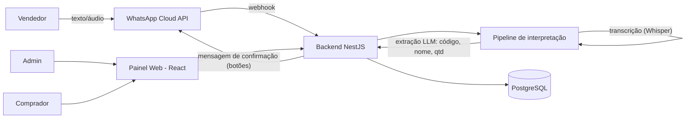
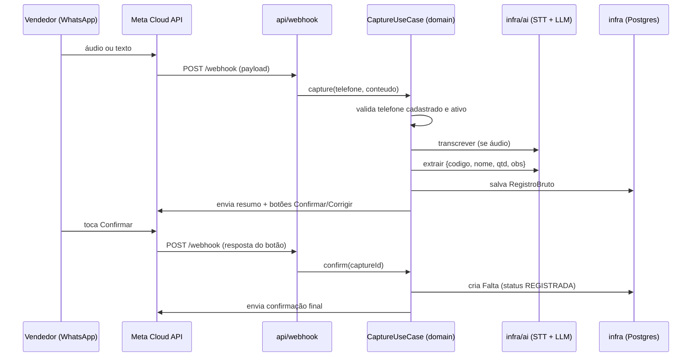

# Arquitetura — Meu Copiloto

> Arquitetura hexagonal (ports & adapters) no backend NestJS, com o WhatsApp e a API REST como adapters de entrada e Postgres/IA/WhatsApp como adapters de saída. Segue o mesmo padrão de rigor do projeto INBORDAL: dependências sempre apontando para o domínio, regras invioláveis, roteiro de feature.

## 1. Visão geral da solução



Componentes:

- **Backend (este repositório)** — NestJS + TypeScript. Expõe a API REST do painel e o webhook do WhatsApp; orquestra o pipeline de interpretação; persiste em PostgreSQL.
- **Painel web (repositório `meu-copiloto-web`)** — React + TypeScript. Login, administração, fila de faltas do comprador, dashboard.
- **Serviços externos** — WhatsApp Cloud API (mensagens), STT (transcrição de áudio), LLM (extração estruturada). Todos atrás de portas de saída.

## 2. As camadas (hexagonal)

```
                chama / aciona                implementa contrato
   api  ──────────────────────────►  domain  ◄─────────────────────────  infra
(entrada:                            (núcleo,                            (saída:
REST + webhook,                     regra pura)                    Postgres, WhatsApp,
driving adapters)                                                  STT, LLM — driven)

     └──────────────── ambos dependem só de domain ────────────────┘
```

- `api` e `infra` nunca se enxergam: toda comunicação passa pelas **portas** (interfaces) do `domain`.
- O `domain` não importa nada de framework — nem NestJS, nem ORM, nem SDK de terceiros.
- Só o composition root (`config/`) conhece implementações concretas.

## 3. Estrutura de pastas do backend

```
src/
├── main.ts                    # bootstrap do NestJS
│
├── domain/
│   ├── core/
│   │   └── result/            # Result<T> (Ok/Err) + Unit — retorno padrão em vez de exceptions
│   ├── entities/              # Store, User, Shortage, RawCapture, StatusTransition
│   ├── failures/              # Failure base + falhas concretas (NotFound, InvalidTransition, Unauthorized...)
│   ├── ports/
│   │   ├── input/             # o que o núcleo OFERECE: 1 interface por feature/contexto
│   │   │                      #   AuthUseCase, UserManagementUseCase, ShortageUseCase, CaptureUseCase, DashboardUseCase
│   │   └── output/            # o que o núcleo PRECISA:
│   │                          #   UserRepository, ShortageRepository, RawCaptureRepository,
│   │                          #   MessagingPort (enviar msg/botões), TranscriptionPort, ExtractionPort
│   └── usecases/              # implementações das portas de entrada (regra de negócio pura)
│
├── infra/
│   ├── database/              # TypeORM/Prisma: schemas, migrations, conexão
│   ├── repositories/          # implementam ports/output combinando database + mappers
│   ├── mappers/               # linha do banco / payload externo → entidade de domínio
│   ├── whatsapp/              # adapter da Cloud API: implementa MessagingPort (envio)
│   ├── ai/                    # adapters de STT (TranscriptionPort) e LLM (ExtractionPort)
│   └── exceptions/            # erros técnicos e tradução para Failure
│
├── api/
│   ├── rest/                  # controllers REST do painel (auth, users, shortages, dashboard) + DTOs
│   ├── webhook/               # controller do webhook WhatsApp (verificação + recepção de mensagens)
│   └── guards/                # autenticação JWT, autorização por papel
│
└── config/
    ├── modules/               # módulos NestJS que ligam interface → implementação (composition root)
    └── env/                   # validação de variáveis de ambiente
```

### Regras que não podem ser violadas

- `domain` não importa nada de `infra`, `api` ou framework.
- `api` importa só `ports/input` (interfaces), nunca `usecases/` nem `infra/`.
- `infra` implementa `ports/output` e não conhece `ports/input`.
- Implementações concretas só são referenciadas dentro de `config/modules/`.
- Ação nova em feature existente = método novo na interface existente, não interface nova.
- Use cases retornam `Result<T>` em vez de lançar exceção. Repositórios (`ports/output`) retornam `Promise<T>`/`Promise<T | null>` puro — não conhecem `Result`, que é um conceito do domínio de aplicação; erros técnicos (banco fora, etc.) sobem como exceção e são capturados pelo use case, que os traduz em `Failure` (ex.: `UnexpectedFailure`).

## 4. Fluxo do webhook (captura via WhatsApp)



Pontos de atenção de implementação:

- O webhook deve responder 200 rápido e processar de forma assíncrona (a Meta reenvia em caso de timeout) — fila interna simples no MVP.
- Idempotência por `message_id` da Meta: reentregas não podem duplicar capturas.
- Captura pendente (aguardando confirmação) expira após janela configurável; expiração marca o `RegistroBruto` como `ABANDONADO`.

## 5. Autenticação e autorização

- **Painel web:** login com e-mail/senha → JWT (access + refresh). Guards do NestJS aplicam papel (`ADMIN`, `VENDEDOR`, `COMPRADOR`) por rota; a regra de negócio de permissão (ex.: vendedor só cancela a própria falta) vive no domínio.
- **Webhook:** verificação do token da Meta (challenge na configuração) + validação de assinatura `X-Hub-Signature-256` em toda requisição.
- **Identidade no WhatsApp:** o telefone remetente é resolvido para um `User` ativo; telefone desconhecido recebe resposta educada e nada é registrado.

## 6. Painel web (repositório separado)

React + TypeScript com uma disciplina de camadas mais leve que a do backend — decisão consciente (2026-08-12), não a divisão `ui`/`domain`/`infra` completa do INBORDAL mobile com portas de caso de uso e injeção via composition root. Para o tamanho de um painel administrativo de uma loja piloto, isso seria over-engineering; a regra que de fato vale, e é a única inegociável ali, é: **componentes/páginas nunca chamam `axios` diretamente — sempre passam por `services/<recurso>.service.ts`**, que é a única camada que conhece a API HTTP. Isso isola qualquer mudança de contrato numa camada só, sem exigir interfaces/DI para um app deste porte. Detalhamento e estrutura de pastas no README do `meu-copiloto-web`.

Se o produto crescer (mais integrações, múltiplos backends, necessidade real de trocar implementação), revisitar essa decisão com um ADR — aí sim migrando `services/` para portas de caso de uso injetáveis, no padrão hexagonal completo.

## 7. Decisões registradas

As decisões estruturais e suas alternativas estão nos ADRs:

- [ADR-0001 — Canal híbrido](adr/0001-canal-hibrido-whatsapp-e-painel-web.md)
- [ADR-0002 — Node/TypeScript + NestJS hexagonal](adr/0002-backend-node-typescript-nestjs.md)
- [ADR-0003 — API oficial da Meta](adr/0003-api-oficial-whatsapp-cloud.md)
- [ADR-0004 — Pipeline de IA com confirmação humana](adr/0004-pipeline-ia-com-confirmacao-humana.md)
